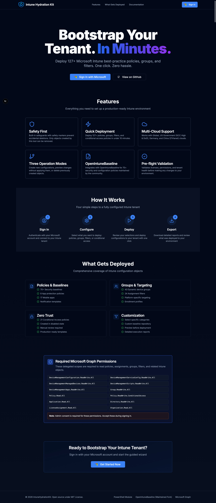

# Intune Hydration Kit - Web Application

A web-based version of the [IntuneHydrationKit PowerShell module](https://github.com/jorgeasaurus/IntuneHydrationKit) that enables IT administrators to bootstrap Microsoft Intune tenants with best-practice configurations through an intuitive browser interface.



## Features

- **Multi-step Wizard**: Guided configuration process with 5 clear steps
- **MSAL Authentication**: Secure authentication with Microsoft Entra ID
- **Multi-Cloud Support**: Compatible with Global, USGov, Germany, and China clouds
- **Safety First**: Built-in safeguards prevent accidental deletions
- **Real-time Progress**: Live updates during policy deployment (Phase 2)
- **Comprehensive Coverage**: Deploy 127+ policies, groups, filters, and more

## Tech Stack

- **Framework**: Next.js 15 (App Router)
- **Language**: TypeScript (strict mode)
- **Authentication**: MSAL React (@azure/msal-react)
- **UI Components**: shadcn/ui (Radix UI + Tailwind CSS)
- **State Management**: React Context + TanStack Query
- **Styling**: Tailwind CSS with dark mode support
- **Icons**: Lucide React
- **Notifications**: Sonner

## Prerequisites

- Node.js 18.17 or later
- npm 9.0 or later
- Microsoft Entra ID (Azure AD) tenant
- Entra ID app registration with required permissions

## Required Microsoft Graph API Permissions

> **📋 Requested Microsoft Graph Permissions**
>
> These scopes are required to read policies, assignments, groups, filters, and related Intune objects.
>
> **Delegated Permissions:**
>
> - `DeviceManagementConfiguration.ReadWrite.All`
> - `DeviceManagementServiceConfig.ReadWrite.All`
> - `DeviceManagementManagedDevices.ReadWrite.All`
> - `DeviceManagementScripts.ReadWrite.All`
> - `DeviceManagementApps.ReadWrite.All`
> - `Group.ReadWrite.All`
> - `Policy.Read.All`
> - `Policy.ReadWrite.ConditionalAccess`
> - `Application.Read.All`
> - `Directory.ReadWrite.All`
> - `LicenseAssignment.Read.All`
> - `Organization.Read.All`
>
> **Note:** Admin consent is required for these permissions.

## Getting Started

### 1. Clone the Repository

```bash
git clone https://github.com/jorgeasaurus/IntuneHydrationKit-WebApp.git
cd IntuneHydrationKit-WebApp
```

### 2. Install Dependencies

```bash
npm install
```

### 3. Configure Environment Variables

Create a `.env.local` file in the root directory:

```bash
cp .env.local.example .env.local
```

Edit `.env.local` with your values:

```env
NEXT_PUBLIC_MSAL_CLIENT_ID=your-client-id-here
NEXT_PUBLIC_MSAL_AUTHORITY=https://login.microsoftonline.com/common
NEXT_PUBLIC_MSAL_REDIRECT_URI=http://localhost:3000
NEXT_PUBLIC_CLOUD_ENVIRONMENT=global
```

### 4. Set Up Entra ID App Registration

1. Go to [Azure Portal](https://portal.azure.com) > Entra ID > App registrations
2. Create a new registration:
   - **Name**: Intune Hydration Kit Web
   - **Supported account types**: Choose appropriate option
   - **Redirect URI**: Web - `http://localhost:3000`
3. Copy the **Application (client) ID** to `NEXT_PUBLIC_MSAL_CLIENT_ID`
4. Go to **API permissions** > Add the required Graph API permissions listed above
5. Click **Grant admin consent** for your tenant

### 5. Run the Development Server

```bash
npm run dev
```

Open [http://localhost:3000](http://localhost:3000) in your browser.

## Available Scripts

- `npm run dev` - Start development server with Turbopack
- `npm run build` - Build for production
- `npm run start` - Start production server
- `npm run lint` - Run ESLint
- `npm run type-check` - Run TypeScript type checking

## Project Structure

```
├── app/                      # Next.js App Router pages
│   ├── layout.tsx           # Root layout with providers
│   ├── page.tsx             # Landing page
│   ├── wizard/              # Multi-step wizard
│   └── dashboard/           # Execution dashboard
├── components/
│   ├── ui/                  # shadcn/ui components
│   ├── auth/                # Authentication components
│   ├── wizard/              # Wizard step components
│   └── providers/           # React providers
├── lib/
│   ├── auth/                # MSAL configuration
│   ├── graph/               # Graph API client
│   ├── hydration/           # Execution engine (Phase 2)
│   └── utils/               # Utility functions
├── types/                   # TypeScript type definitions
├── hooks/                   # Custom React hooks
└── templates/               # Intune policy templates (Phase 2)
```

## Development Status

### ✅ Phase 1: Foundation (Completed)

- [x] Next.js 15 project setup with TypeScript
- [x] MSAL authentication flow
- [x] Basic 5-step wizard shell
- [x] shadcn/ui component library
- [x] Graph API client wrapper with retry logic

### 🚧 Phase 2: Core Hydration (In Progress)

- [ ] Template TypeScript files
- [ ] Task execution engine
- [ ] Graph API service functions
- [ ] Pre-flight validation
- [ ] Error handling and retry logic

### 📋 Phase 3-5: Coming Soon

- Phase 3: UI & UX improvements
- Phase 4: Advanced features (drift detection, conflict resolution)
- Phase 5: Testing and deployment

## Configuration

### Cloud Environments

The application supports multiple Microsoft cloud environments:

- **global** - Commercial cloud (default)
- **usgov** - US Government (GCC High)
- **usgovdod** - US Government (DoD)
- **germany** - Germany cloud
- **china** - China (21Vianet)

### Operation Modes

1. **Create** - Deploy new configurations (skips existing objects)
2. **Preview** - Show what would happen without making changes
3. **Delete** - Remove configurations created by this tool

## Security Considerations

- Access tokens are stored in `sessionStorage` (never in `localStorage`)
- All Graph API calls use HTTPS
- Content Security Policy headers configured
- No sensitive data logging
- Session timeout after 1 hour of inactivity

## Troubleshooting

### "No active account found" Error

Make sure you've signed in through the landing page before accessing the wizard.

### CORS Errors

Ensure your redirect URI in Entra ID matches exactly with `NEXT_PUBLIC_MSAL_REDIRECT_URI`.

### Permission Errors

Verify that:
1. All required Graph API permissions are added to your app registration
2. Admin consent has been granted
3. You're signed in with an account that has Intune Admin or Global Admin role

## Contributing

This project is under active development. Contributions are welcome!

1. Fork the repository
2. Create a feature branch
3. Make your changes
4. Submit a pull request

## License

MIT License - See LICENSE file for details

## Related Projects

- [IntuneHydrationKit PowerShell Module](https://github.com/jorgeasaurus/IntuneHydrationKit)
- [OpenIntuneBaseline](https://github.com/jorgeasaurus/OpenIntuneBaseline)

## Support

For issues and questions:
- Create an issue on GitHub
- Check the [PowerShell module documentation](https://github.com/jorgeasaurus/IntuneHydrationKit)
- Review Microsoft Graph API documentation

---

**Note**: This is a web interface for the IntuneHydrationKit. Power users can continue using the PowerShell module for automation scenarios.
