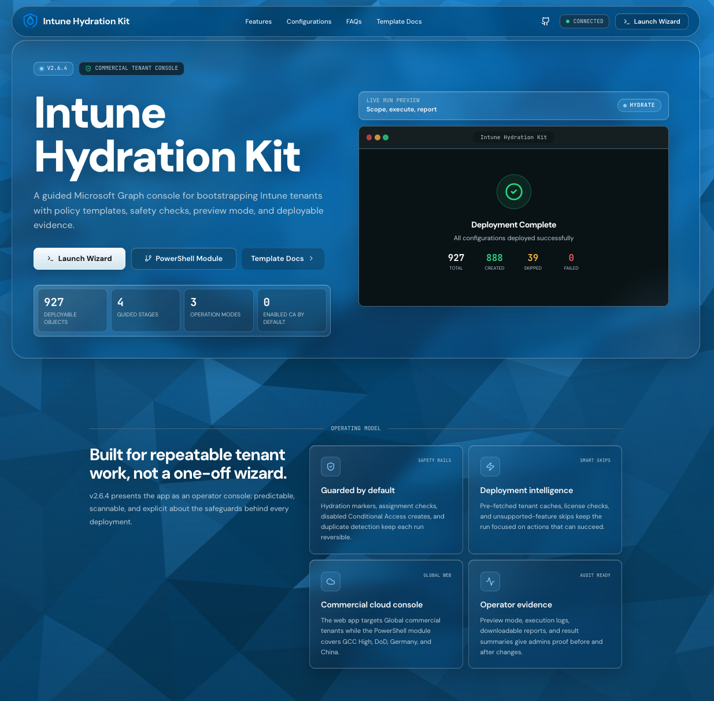

<p align="center">
  
</p>

<h1 align="center">Intune Hydration Kit</h1>

<p align="center">
  <strong>A guided Microsoft Graph console for repeatable Intune tenant deployments.</strong>
</p>

<p align="center">
  Apply recommended configurations. Preview every change. Keep clear evidence for each run.
</p>

<p align="center">
  
  
  
  
  
</p>

<p align="center">
  <a href="#why-intune-hydration-kit">Why this app</a> ·
  <a href="#getting-started">Quick start</a> ·
  <a href="#wizard-workflow">Workflow</a> ·
  <a href="#security-considerations">Security</a> ·
  <a href="#deployment">Deployment</a>
</p>

<br />

[](./NewPage.png)

## Why Intune Hydration Kit

The web app gives administrators a guided browser interface for the workflow in the [IntuneHydrationKit PowerShell module](https://github.com/jorgeasaurus/IntuneHydrationKit).

| Guided deployment | Default safeguards | Run records |
| --- | --- | --- |
| Use the four-stage wizard to sign in to a tenant and start an operation. | Ownership markers, assignment checks, and disabled Conditional Access policies protect delete operations. | Preview mode, live status, execution logs, and downloadable reports show what changed. |
| **Deployment checks** | **Local template catalog** | **Execution control** |
| The app checks for existing objects and caches tenant data. These actions reduce unnecessary work. | The catalog loads import-ready payloads from the bundled IntuneTemplates and CIS baseline manifests. It does not use the GitHub API at runtime. | The sequential queue limits Graph throttling. You can pause, resume, or cancel a run. |

### Configuration types

| Identity and targeting | Device management | Security and applications |
| --- | --- | --- |
| Entra groups and device filters | Compliance policies, enrollment profiles, and notifications | Security baselines, Conditional Access, app protection, mobile apps, and Win32 apps |

The web app supports Global commercial tenants. Use the PowerShell module for US Government, Germany, and China tenants.

## Built with

| Layer | Technology |
| --- | --- |
| Application | Next.js 15 App Router and TypeScript strict mode |
| Authentication | MSAL React with delegated Microsoft Graph access |
| Interface | shadcn/ui, Radix UI, Tailwind CSS, and Lucide React |
| State | React Context and local React state |
| Feedback | Sonner notifications and live task status |

## Prerequisites

- Node.js 18.17 or later
- npm 9.0 or later
- Microsoft Entra ID (Azure AD) tenant
- Entra ID app registration with required permissions

## Required Microsoft Graph API Permissions

> **Required Microsoft Graph permissions**
>
> These scopes are required to read policies, assignments, groups, filters, and related Intune objects.
>
> **Delegated permissions:**
>
> - `DeviceManagementConfiguration.ReadWrite.All`
> - `DeviceManagementServiceConfig.ReadWrite.All`
> - `DeviceManagementManagedDevices.ReadWrite.All`
> - `DeviceManagementScripts.ReadWrite.All`
> - `DeviceManagementApps.ReadWrite.All`
> - `Group.ReadWrite.All`
> - `Policy.Read.All`
> - `Policy.ReadWrite.ConditionalAccess`
> - `Application.Read.All`
> - `Directory.ReadWrite.All`
> - `LicenseAssignment.Read.All`
> - `Organization.Read.All`
>
> **Important:** Admin consent is required for these permissions.

## Getting Started

### 1. Clone the Repository

```bash
git clone https://github.com/jorgeasaurus/IntuneHydrationKit-WebApp.git
cd IntuneHydrationKit-WebApp
```

### 2. Install Dependencies

```bash
npm install
```

### 3. Configure Environment Variables

Create a `.env.local` file in the root directory:

```bash
cp .env.local.example .env.local
```

Edit `.env.local` with your values:

```env
NEXT_PUBLIC_MSAL_CLIENT_ID=your-client-id-here
NEXT_PUBLIC_MSAL_AUTHORITY=https://login.microsoftonline.com/common
NEXT_PUBLIC_MSAL_REDIRECT_URI=http://localhost:3000
NEXT_PUBLIC_CLOUD_ENVIRONMENT=global
```

### 4. Set Up Entra ID App Registration

1. Go to [Azure Portal](https://portal.azure.com) > Entra ID > App registrations
2. Create a new registration:
   - **Name**: Intune Hydration Kit Web
   - **Supported account types**: Choose appropriate option
   - **Redirect URI**: Web - `http://localhost:3000`
3. Copy the **Application (client) ID** to `NEXT_PUBLIC_MSAL_CLIENT_ID`
4. Go to **API permissions** > Add the required Graph API permissions listed above
5. Click **Grant admin consent** for your tenant

### 5. Run the Development Server

```bash
npm run dev
```

Open [http://localhost:3000](http://localhost:3000) in your browser.

## Recent updates

### January 2026

| Area | Update |
| --- | --- |
| Wizard | Reduced the workflow to four stages and moved template loading to the local catalog. |
| App protection | Added 10 policies, PowerShell module parity, platform detection, and a 90% reduction in API requests. |
| Execution | Added duplicate-run protection, pause and resume controls, cancellation, and cache versioning. |
| Interface | Improved mobile layouts, dark mode, live task status, and application branding. |

## Available Scripts

- `npm run dev` - Start development server
- `npm run dev:turbo` - Start development server with Turbopack
- `npm run build` - Build for production
- `npm run start` - Start production server
- `npm run lint` - Run ESLint
- `npm run type-check` - Run TypeScript type checking

## Project Structure

```
├── app/                      # Next.js App Router pages
│   ├── layout.tsx           # Root layout with providers
│   ├── page.tsx             # Landing page
│   ├── wizard/              # 4-step configuration wizard
│   ├── dashboard/           # Real-time execution dashboard
│   └── results/             # Execution results and reporting
├── components/
│   ├── ui/                  # shadcn/ui components
│   ├── auth/                # Authentication components
│   ├── wizard/              # Wizard step components
│   ├── dashboard/           # Dashboard components (progress, task list, controls)
│   └── providers/           # React providers
├── lib/
│   ├── auth/                # MSAL configuration
│   ├── graph/               # Graph API client & operations
│   ├── hydration/           # Task execution engine
│   ├── templates/           # Template loader (local files)
│   └── utils/               # Utility functions
├── public/
│   └── IntuneTemplates/     # Bundled Intune and OpenIntuneBaseline payloads
├── types/                   # TypeScript type definitions
├── hooks/                   # Custom React hooks
└── templates/               # Template metadata
```

## Wizard Workflow

The application uses a four-stage process.

| Stage | Purpose | Result |
| ---: | --- | --- |
| **01** | **Connect** — Enter the tenant. Confirm the Global commercial cloud. Sign in with Microsoft Entra ID. | The app verifies the tenant session. |
| **02** | **Choose an operation** — Select Create, Preview, or Delete. | The operation is selected. |
| **03** | **Select targets** — Choose policy categories and individual templates. | The app creates an execution queue for the selected items. |
| **04** | **Review and run** — Check the object counts. Confirm the operation. Start the execution. | The app shows live progress and creates a downloadable report. |

## Configuration

### Cloud Environments

The web app currently supports the following Microsoft cloud environment:

- **global** - Commercial cloud (default)

For sovereign and government clouds, use the IntuneHydrationKit PowerShell module:

- **usgov** - US Government (GCC High)
- **usgovdod** - US Government (DoD)
- **germany** - Germany cloud
- **china** - China (21Vianet)

### Operation Modes

1. **Create** - Deploy new configurations (skips existing objects)
2. **Preview** - Show what would happen without making changes
3. **Delete** - Remove configurations created by this tool (only deletes items with hydration marker)

## Security Considerations

- Access tokens are stored in `sessionStorage` (never in `localStorage`)
- All Graph API calls use HTTPS
- Content Security Policy headers configured
- No sensitive data logging
- Session timeout after 1 hour of inactivity

## Performance Optimizations

### Template Loading
- **Bundled metadata**: Template metadata loads from local manifests, and payloads load on demand
- **Session Caching**: Templates cached with automatic version invalidation
- **No Network Dependency**: No GitHub API calls during template loading

### API Efficiency
- **Pre-fetch Optimization**: App Protection operations reduced from 10 API calls to 1 (90% reduction)
- **Smart Caching**: Policies cached in execution context and synchronized after create/delete
- **Rate Limiting Protection**: 2-second delay between tasks + exponential backoff on 429 errors

### Execution Reliability
- **Duplicate Prevention**: Execution lock prevents React Strict Mode double-invocation
- **Error Recovery**: Comprehensive error handling with retry logic (max 3 attempts)
- **Graceful Degradation**: Failed tasks don't block subsequent operations

## Deployment

This application requires a platform that supports Next.js SSR/SSG and cannot be deployed to GitHub Pages.

### Recommended Platforms

1. **Vercel** (recommended)
   - Zero-configuration deployment
   - Automatic HTTPS and global CDN
   - Perfect Next.js optimization
   - Free tier available
   - Deploy: `vercel --prod`

2. **Azure Static Web Apps**
   - Microsoft ecosystem integration
   - Seamless Entra ID integration
   - Built-in authentication providers
   - Free tier available

3. **Netlify**
   - Alternative to Vercel
   - Easy deployment
   - Good Next.js support
   - Free tier available

4. **Self-Hosted (Docker)**
   - Full control
   - On-premises deployment
   - Air-gapped environments
   - Infrastructure costs only

### Quick Deploy to Vercel

```bash
# Install Vercel CLI
npm install -g vercel

# Deploy
vercel

# Configure environment variables in Vercel Dashboard
# Deploy to production
vercel --prod
```

**Important**: After deployment, update your Entra ID app registration with the production redirect URI.

## Troubleshooting

### "No active account found" Error

Make sure you've signed in through the landing page before accessing the wizard.

### CORS Errors

Ensure your redirect URI in Entra ID matches exactly with `NEXT_PUBLIC_MSAL_REDIRECT_URI`.

### Permission Errors

Verify that:
1. All required Graph API permissions are added to your app registration
2. Admin consent has been granted
3. You're signed in with an account that has Intune Admin or Global Admin role

## Contributing

Code contributions require a separate written contributor agreement. Do not
submit a pull request unless one is in place.

## License

This software is proprietary. Evaluation is permitted only under the terms in
the [Commercial End User License Agreement](LICENSE); production and other
commercial use require a separately purchased written license.

## Related projects

- [IntuneHydrationKit PowerShell Module](https://github.com/jorgeasaurus/IntuneHydrationKit)
- [OpenIntuneBaseline](https://github.com/jorgeasaurus/OpenIntuneBaseline)

## Support

For issues and questions:
- Create an issue on GitHub
- Check the [PowerShell module documentation](https://github.com/jorgeasaurus/IntuneHydrationKit)
- Review Microsoft Graph API documentation

---

<p align="center">
  
</p>

<p align="center">
  <strong>Use the browser for guidance. Use PowerShell for automated tasks.</strong>
</p>
